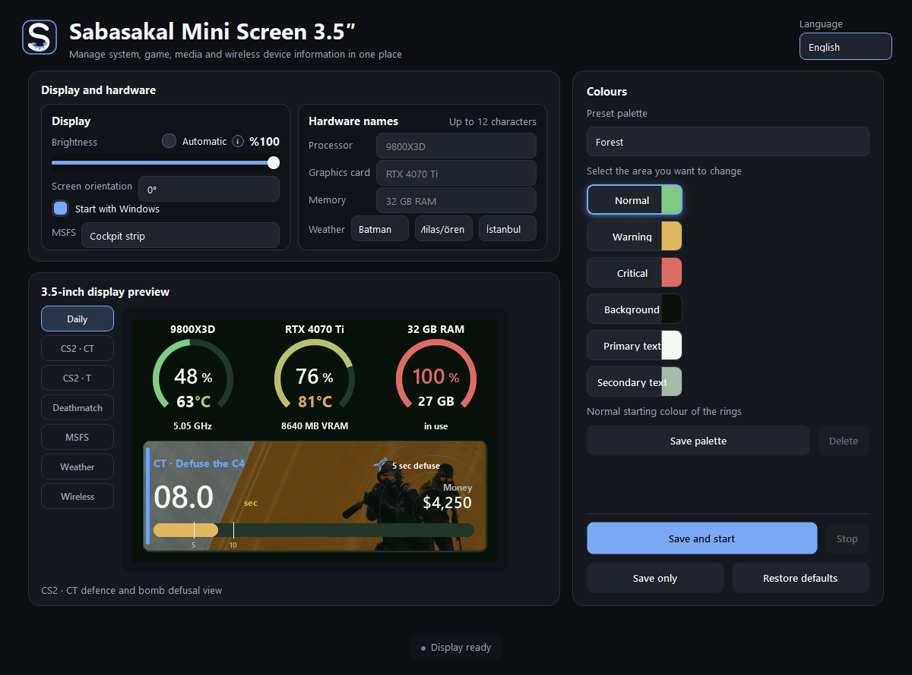
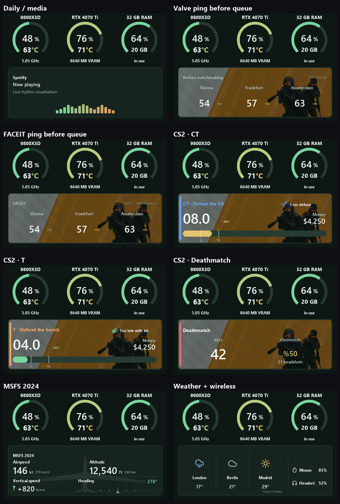
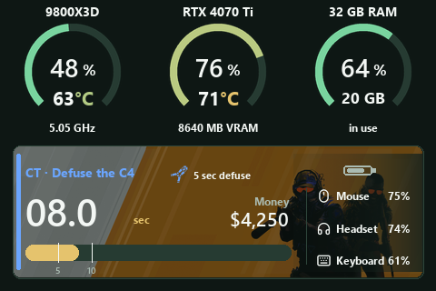
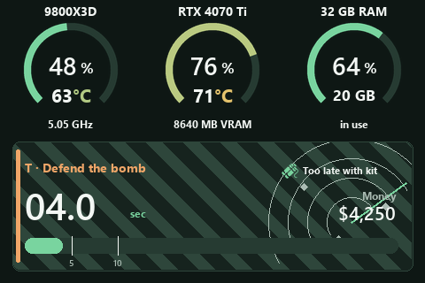
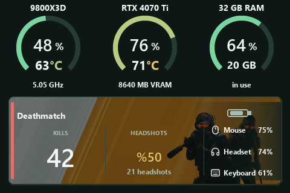

# Sabasakal Mini Screen 3.5″

A modern Windows dashboard for 480×320 USB mini displays. It combines live PC
telemetry, game-aware panels, media animation, weather and wireless-device
battery information in one compact, themeable interface.



## Highlights

- CPU, discrete GPU and RAM rings with component-specific warning thresholds
- CPU/GPU temperature, CPU clock, VRAM and used-memory readouts
- Smooth critical alerts for load and temperature
- CS2 pre-queue Valve/FACEIT ping view using non-invasive public/local data
- CS2 CT/T bomb timing, competitive/Wingman economy and deathmatch statistics
- MSFS 2024 altitude, airspeed, vertical speed and heading panels
- Live media spectrum plus platform/track metadata
- Automatic Logitech G HUB and Windows battery-device discovery
- Three-city weather panel powered by Open-Meteo
- 18 built-in palettes, named custom palettes and user hardware labels
- Manual or time-based brightness, 0°/180° rotation and Windows auto-start
- Turkish and English across the settings UI, tray, statuses and every display
  mode



## CS2 previews

### CT bomb panel



### T bomb panel



### Deathmatch panel



## Download and run

1. Open the latest GitHub **Release**.
2. Download `Sabasakal-Mini-Screen-3.5.zip`.
3. Extract the ZIP to a normal user folder.
4. Run `Sabasakal-Mini-Screen.exe`.
5. Select the language, display orientation and brightness, then choose
   **Save and start**.

Windows SmartScreen may warn about an unsigned community binary. Verify the
published SHA-256 file before running it. No installer is required. Keep the
extracted `_internal` folder beside the EXE; the folder-based portable package
avoids temporary `_MEI` extraction and its associated startup/cleanup failures.

## Supported environment

- Windows 10 or Windows 11, 64-bit
- Turing Smart Screen-compatible 3.5-inch 480×320 serial display (the current
  binary is tested with the common Rev-A/Turing protocol)
- Optional: Logitech G HUB for Logitech wireless battery values
- Optional: CS2 and/or Microsoft Flight Simulator 2024 for game panels

Hardware revisions sold under similar names can use different USB protocols.
If the app cannot find the display, open an issue with the USB/COM identity and
do not upload personal logs without reviewing them first.

## Safety and privacy

The CS2 integration uses Valve Game State Integration and locally produced
console/network information. It does not read or write game memory, inject
code, automate input, inspect packets or bypass anti-cheat software. The same
non-invasive rule applies while FACEIT Anti-Cheat is running.

Settings and short-lived sensor/game state caches stay under `%APPDATA%` on the
local PC. Weather requests send only the selected city names/coordinates to
Open-Meteo. See [PRIVACY.md](PRIVACY.md) for details.

## Build from source

Python 3.12, the .NET 10 SDK and Windows are recommended. Build the hidden
native sensor helper first; PyInstaller then embeds that helper in the portable
application.

```powershell
py -3.12 -m venv .venv
.\.venv\Scripts\python.exe -m pip install -r requirements-dev.txt
.\.venv\Scripts\python.exe -m unittest test_scenarios.py -v
dotnet publish sensor-helper\SensorBridge.csproj -c Release -r win-x64 -o sensor-helper\publish
.\.venv\Scripts\python.exe -m PyInstaller --clean Sabasakal-Mini-Screen.spec
```

The repository contains the exact GPL display-driver source snapshot used by
the build. Hardware sensor DLLs are the unmodified LibreHardwareMonitor 0.9.6
release graph and are inventoried in [THIRD_PARTY_NOTICES.md](THIRD_PARTY_NOTICES.md).

## Languages

Choose **Türkçe** or **English** in the top-right corner. The selection is saved
and applies to the control panel, system tray, status messages and all mini
display views.

## License

GPL-3.0-or-later. See [LICENSE](LICENSE) and
[THIRD_PARTY_NOTICES.md](THIRD_PARTY_NOTICES.md).
